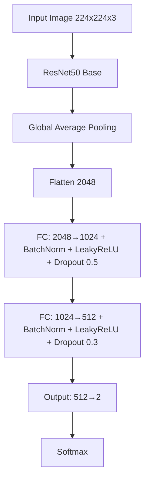

```mermaid
graph TD
    A[Input Image 224x224x3] --> B[ResNet50 Base]
    B --> C[Global Average Pooling]
    C --> D[Flatten 2048]
    D --> E[FC: 2048→1024 + BatchNorm + LeakyReLU + Dropout 0.5]
    E --> F[FC: 1024→512 + BatchNorm + LeakyReLU + Dropout 0.3]
    F --> G[Output: 512→2]
    G --> H[Softmax]
```